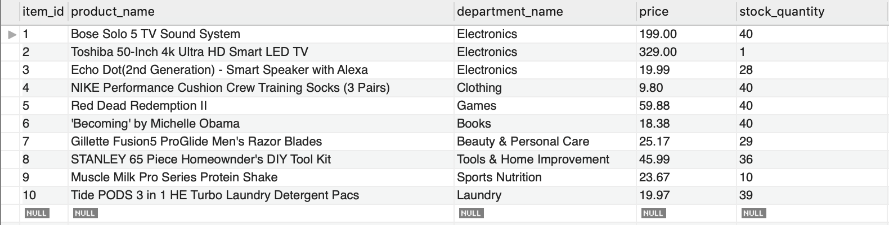
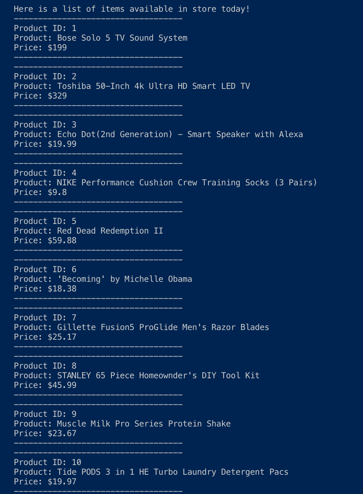
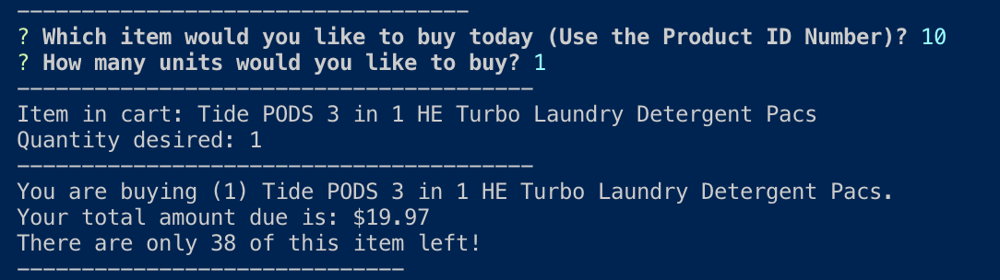
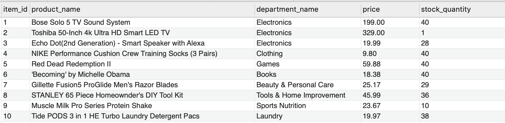
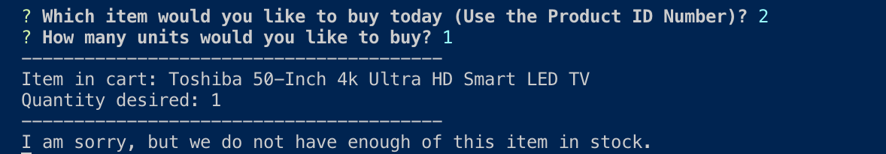

# Bamazon Project 

## Overview
In this project, I created an open source relational database management system using MySQL. Combining JavaScript, Node, and MySQL I was able to create a database that contains a list of 10 items with the following info about each item:
  - Item Id
  - Product Name 
  - Department Name
  - Price 
  - Stock Quantity 

In MySQL, the database table looks as follows: 



In the .sql file the original quantities were set to 40, but as users bought items using Node, a function was created to dynamically substract the quantity of the item available from the database. 

### Steps of the Project
1.  
By typing the following code in a node terminal: 
```
node bamazonCustomer.js
```
the list of ten items inputted into the database appears in the terminal as shown: 



2. 
Inquirer then prompts the user to select which item they would like to buy using the Product ID number, and secondly how many units of that item they would like to buy. Once the user answers the questions, the item and the quantity is displayed in their cart. The total amount due is also diplayed in the terminal, and remianing number of items left in store are also shown in the terminal. 
  - Item 10 (which corresponds to the Tide Pods) was selected at a quantity of 1



3. 
Looking back at the MySQl workbench, the quantity of Item 10 decreased by one based on step 2. The previous quantity was at 39 shown in "Image of MySQL WorkBench Table". The new quantity is shown below: 



4. 
Additionally, when an item runs out in the store the console prompts the user: 



### Bamazon Manager 
In the bamazonManager.js file, I used Inquirer and MySql node packages to update the bamazon database in MySQL. This application asked the user (a manager of the store) if they would like to do one of the following things. 
  - View Products For Sale 
  - View Low Inventory 
  - Add to Inventory 
  - Add New Product
This selection was done usign the inquirer npm package. The user selects which his or her action would like to be, and that decision starts a specific function to complete the desried task. 

##### View Products For Sale 
Lists the entire products table from the bamazon database in the terminal (displayed in an object). 

#### View Low Inventory
Lists all the items in the products table that have a stock quantity of five or lower. 

#### Add to Inventory 
Allows the manager to add 10 more units of a desired item in their store. 

#### Add New Product 
An inquirer prompts the manager on what new item he or she would like to add to their database with the correspong price, quantity, an department. After the inquirer prompt is finished, the database is dynamically updated with the new item. 
